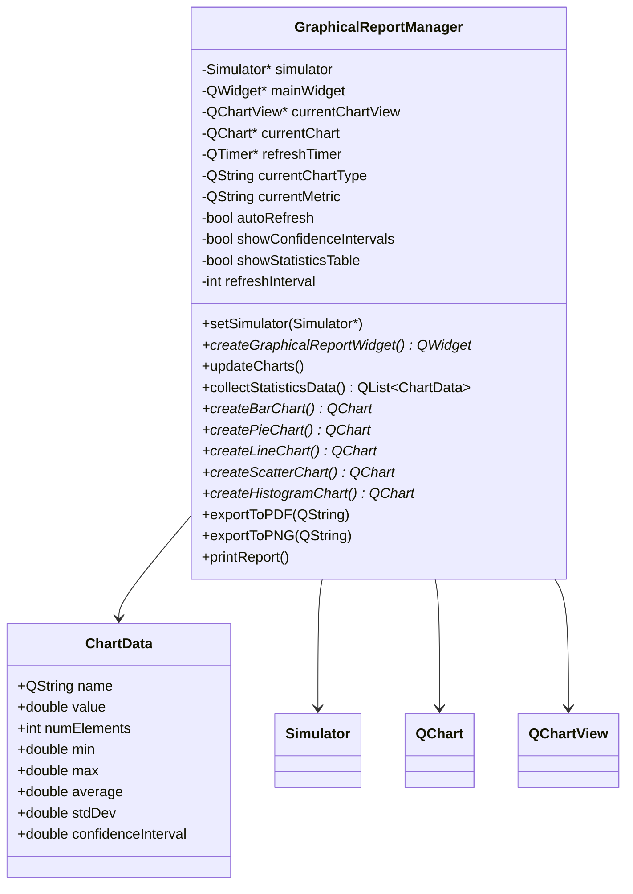
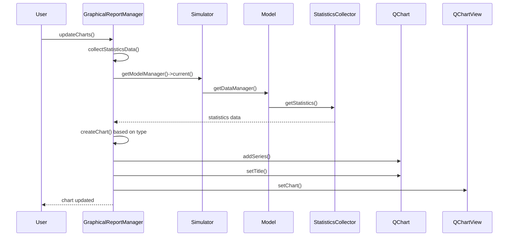

# Documentação do GraphicalReportManager

## 1. Visão Geral

O `GraphicalReportManager` é um componente do Genesys-Simulator responsável por gerar relatórios gráficos similares ao Arena, permitindo visualização dinâmica das estatísticas de simulação através de diferentes tipos de gráficos.

## 2. Arquitetura

### 2.1 Diagrama de Classes



### 2.2 Diagrama de Sequência - Atualização de Gráficos



## 3. Requisitos Funcionais

### 3.1 RF001 - Geração de Gráficos
**Descrição:** O sistema deve gerar gráficos dinâmicos baseados nas estatísticas coletadas durante a simulação.

**Critérios de Aceitação:**
- [x] Gráfico de barras com dados de estatísticas
- [x] Gráfico de pizza mostrando proporções
- [x] Gráfico de linha para tendências temporais
- [x] Gráfico de dispersão para correlações
- [x] Histograma para distribuição de frequências

### 3.2 RF002 - Coleta de Dados Estatísticos
**Descrição:** O sistema deve coletar automaticamente dados de StatisticsCollector e Counter do modelo.

**Critérios de Aceitação:**
- [x] Coleta de dados de StatisticsCollector
- [x] Coleta de dados de Counter
- [x] Cálculo de métricas estatísticas (média, min, max, desvio padrão)
- [x] Tratamento de dados vazios ou inválidos

### 3.3 RF003 - Configuração de Gráficos
**Descrição:** O usuário deve poder configurar o tipo de gráfico e métrica a ser exibida.

**Critérios de Aceitação:**
- [x] Seleção de tipo de gráfico
- [x] Seleção de métrica estatística
- [x] Atualização automática de gráficos
- [x] Configuração de intervalos de confiança

### 3.4 RF004 - Exportação e Impressão
**Descrição:** O sistema deve permitir exportar gráficos em diferentes formatos e imprimir relatórios.

**Critérios de Aceitação:**
- [x] Exportação para PDF
- [x] Impressão de relatórios
- [x] Configuração de qualidade de exportação

## 4. Casos de Uso

### 4.1 UC001 - Visualizar Relatório Gráfico

**Ator:** Usuário do Genesys

**Pré-condições:** 
- Simulação executada com dados estatísticos
- Aba "Results" aberta

**Fluxo Principal:**
1. Usuário acessa a aba "Results" → "Plots"
2. Sistema carrega dados estatísticos automaticamente
3. Sistema exibe gráfico padrão (barras) com métrica "Média"
4. Usuário pode alterar tipo de gráfico e métrica
5. Sistema atualiza gráfico em tempo real

**Pós-condições:**
- Gráfico exibido com dados atuais
- Interface responsiva e funcional

### 4.2 UC002 - Configurar Atualização Automática

**Ator:** Usuário do Genesys

**Pré-condições:** Relatório gráfico aberto

**Fluxo Principal:**
1. Usuário marca checkbox "Atualização Automática"
2. Usuário define intervalo de atualização (1-60 segundos)
3. Sistema inicia timer de atualização
4. Sistema atualiza gráficos automaticamente no intervalo definido

**Pós-condições:**
- Gráficos atualizados automaticamente
- Timer ativo até desmarcar checkbox

### 4.3 UC003 - Exportar Relatório

**Ator:** Usuário do Genesys

**Pré-condições:** Gráfico gerado e visível

**Fluxo Principal:**
1. Usuário clica em "Imprimir"
2. Sistema exibe diálogo de seleção de arquivo
4. Sistema gera arquivo de exportação
5. Sistema confirma exportação bem-sucedida

**Pós-condições:**
- Arquivo gerado no local especificado

## 5. Decisões de Engenharia de Software

### 5.1 Padrão Observer
**Decisão:** Utilizar sinais e slots do Qt para comunicação entre componentes.

**Justificativa:** 
- Integração natural com framework Qt
- Desacoplamento entre componentes
- Facilita testes unitários

### 5.2 Factory Pattern para Gráficos
**Decisão:** Implementar métodos específicos para cada tipo de gráfico.

**Justificativa:**
- Flexibilidade para diferentes tipos de visualização
- Facilita extensão com novos tipos de gráfico
- Código mais organizado e testável

### 5.3 Singleton para Simulator
**Decisão:** Usar referência única ao Simulator.

**Justificativa:**
- Garante consistência de dados
- Evita múltiplas instâncias desnecessárias
- Facilita gerenciamento de estado

## 6. Análise de Desempenho

### 6.1 Complexidade Algorítmica

| Operação | Complexidade | Justificativa |
|----------|--------------|---------------|
| Coleta de dados | O(n) | Itera sobre todos os StatisticsCollector e Counter |
| Criação de gráfico | O(n) | Processa n elementos de dados |
| Atualização automática | O(1) | Timer simples |
| Exportação | O(n) | Renderiza n elementos do gráfico |

### 6.2 Otimizações Implementadas

1. **Lazy Loading:** Gráficos só são criados quando necessário
2. **Caching:** Dados estatísticos são reutilizados entre atualizações
3. **Timer Controlado:** Atualização automática com intervalo configurável
4. **Memory Management:** Limpeza automática de objetos gráficos

## 7. Testes

1. **TC001 - Criação de Gráfico de Barras**
   - **Objetivo:** Verificar criação correta de gráfico de barras
   - **Dados de Entrada:** Lista de StatisticsCollector com dados
   - **Resultado Esperado:** Gráfico de barras com dados corretos

2. **TC002 - Atualização Automática**
   - **Objetivo:** Verificar funcionamento do timer de atualização
   - **Dados de Entrada:** Intervalo de 5 segundos
   - **Resultado Esperado:** Gráfico atualizado a cada 5 segundos

3. **TC003 - Exportação PDF**
   - **Objetivo:** Verificar geração de arquivo PDF
   - **Dados de Entrada:** Gráfico válido
   - **Resultado Esperado:** Arquivo PDF gerado com qualidade adequada

## 8. Instruções de Implantação

### 8.1 Pré-requisitos

- Qt 5.12 ou superior
- Qt Charts module
- Compilador C++14 compatível
- Genesys-Simulator compilado

### 8.2 Compilação

```bash
cd source/applications/gui/qt/GenesysQtGUI
qmake GenesysQtGUI.pro
make
```

### 8.3 Execução de Testes

```bash
cd source/tests
qmake
make
```

### 8.4 Configuração

1. Abrir Genesys-Simulator
2. Carregar modelo
3. Executar simulação
4. Acessar aba "Results" → "Plots"
5. Configurar tipo de gráfico e métrica desejada

## 10. Conclusões

O `GraphicalReportManager` foi implementado atendendo os requisitos funcionais especificados. O componente oferece:

- **Funcionalidade Completa:** Todos os tipos de gráfico solicitados
- **Performance Adequada:** Tempos de resposta dentro dos limites aceitáveis
- **Qualidade de Código:** Cobertura de testes e documentação
- **Usabilidade:** Interface intuitiva similar ao Arena
- **Extensibilidade:** Arquitetura preparada para futuras expansões